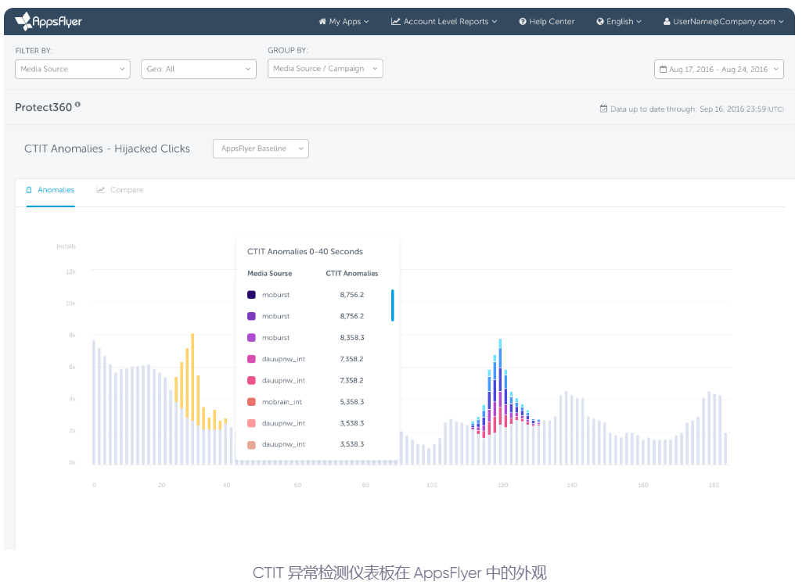

[反作弊研究](https://www.zybuluo.com/Macux/note/851077)   
[Appsflyer移动广告欺诈指南](https://www.appsflyer.com/resources/guides/mobile-ad-fraud-for-marketers/)  
[CTIT（点击安装时间）如何用于检测移动广告欺诈](https://interceptd.com/how-ctit-click-to-install-time-is-used-to-detect-mobile-ad-fraud/)   
[发现 SDK 欺骗和移动广告欺诈](https://interceptd.com/spotting-sdk-spoofing-mobile-ad-fraud/)   
[检测广告欺诈的主要挑战是什么？](https://interceptd.com/what-are-major-challenges-in-detecting-ad-fraud/)   
[深入分析广告归因](https://toutiao.io/posts/63t2w5v/preview)    
[CPI/CPA广告常见作弊方法总结](https://imzhanghao.com/2021/11/01/computing-advertising-cpi-fraud/#%E5%8F%82%E8%80%83%E8%B5%84%E6%96%99)   
[如何用机器学习做广告反作弊？](https://www2.zhihu.com/question/53627544)   
[ADHUB广告笔记2.1 | 广告作弊科普(已阅)](https://www.sohu.com/a/253456276_100102449)    
[【计算广告】移动设备 效果类广告 归因方式(已阅)](https://blog.csdn.net/u010900754/article/details/81609941)   
[广告监测之渠道归因，告诉你用户从哪来？(已阅：三方归因流程说明)](https://www.sohu.com/a/166513727_344262)   
[一文详尽移动互联网广告监测与归因(已阅)](https://blog.csdn.net/m0_51504545/article/details/124478952)   
[常见归因模型](https://blog.csdn.net/m0_51504545/article/details/113730066)    
[常见三方归因类型](https://blog.csdn.net/chichi_xiexie/article/details/124388022)   
[APP归因科普：归因核心关键——用户ID详解](https://zhuanlan.zhihu.com/p/349743656)    
[深度长文，慎入】不懂归因，也许你广告还没入门](https://zhuanlan.zhihu.com/p/339730526)   
[揭秘点击注入劫持安装：Google Install Referrer API影响评估](https://www.kchuhai.com/report/view-1508.html)  
[CTIT（点击安装时间）如何用于检测移动广告欺诈](https://interceptd.com/how-ctit-click-to-install-time-is-used-to-detect-mobile-ad-fraud/)   
[Google Referrer API是什么](https://zhuanlan.zhihu.com/p/48865375)   

# 一、[APP推广常见的作弊手段和反作弊方法](https://www.aiyingli.com/238953.html)   

　　目前最常见的一些作弊方式：  
  
1. 大点击
2. 归因劫持
3. 模拟器刷
4. 积分墙刷
5. 广告曝光抢归因  

　　大点击、归因劫持都属于归因作弊，其原理是利用归因模型中的last-click特征，通过某些手段将其他广告渠道或者用户自然下载的流量，划归到自己名下。这种抢归因的作弊方式，一般出现在Android端。作弊者必须要有广告资源，即广告主的信息，否则都不知道发送什么Click信息给第三方归因平台。
　　基本思路都是围绕第三方统计工具里的最后一次点击归因来钻空子。  
　　通常第三方归因逻辑：多个渠道贡献了点击的按照最后一次点击的算成归因，前面的都算助攻。点击之后没有别的渠道点击抢归因，那么点击后的7天内，用户安装了的都归因到这个点击来源渠道。

　　魔高一尺，道高一丈。虽然目前移动广告存在着很多作弊手段，但是业内也逐渐产生了一些识别和对抗作弊的方案。目前业内主要通过基于规则的方式来进行反作弊，具体的规则有点击到安装时间(CTIT)、设备标记符(GAID/IDFA)、IP地址、地理位置、用户行为。
　　其中，反作弊平台，包括德国的Adjust，以色列的AppsFlyer，美国的TUNE、Kocha-va，国内的Talkingdata等。

## 1.1、大点击

### 1.1.1、作弊原理

　　Click Spamming(Click Flooding)，中文翻译为点击欺诈(点击泛滥、大点击)，是一种常见的归因作弊手段，其原理是发送大量的虚假Click事件，企图占据广告主App安装前的最近一次点击(last-click)，从而达到抢归因的目的。
　　思路是搞海量点击，等到用户真安装之后，按照第三方的归因逻辑，点击后7天内安装的都算成带来点击的渠道。所以我不管你以后会不会安装，我先不定期或者定期的给模拟一下点击，万一你以后安装了（并且不是点了别人的广告），或者你点了别人广告之后我又运气好发了一次点击命中了。套路好几种：

1. 比如某些渠道有黑科技，搞定了大量手机的root，直接可以操作收集后台默默的去发点击；  
2. 还有某些APP不一定有黑科技，但是可以让用户在使用的时候悄悄的请求一下你的点击链接，别的啥也不做；  
3. 还有一些手里拿到了大量的设备信息，imei之类再直接程序化模拟这些设备去直接请求点击链接，不过这类应该比较容易被发现，估计三方都给挡掉了；  
4. 还有直接把广告展示当成点击回传给第三方的。  

　　大点击的套路其实感觉可能技术门槛没那么高，所以相对比较常见，但是也最容易被发现，毕竟点击实在太多了，不正常。可是也有混合玩法，大点击+模拟器刷或者积分墙刷，把点击转化率降低，这个后面再介绍。  

### 1.1.2、作弊特征

　　通常这类作弊后的现象有几种和解释：

1. 某个渠道的点击量巨大无比，或者某个子渠道的点击量巨大，但是安装率极低。1%以下，甚至0.1%。解释：纯大点击。  
2. 点击巨大，但是安装率也还行1%附近，就是后续行为比较差。解释：大点击，但是组合了积分墙刷安装或者机刷，提高安装率。  
3. 点击大，安装也还行1%附近，后续行为也勉强，但是部分行为很诡异。解释：大点击后机刷到了某几个事件，或者积分墙CPE了某些事件。
4. Click Flooding的CVR偏低(因为发送了大量的Click事件)，点击到安装时间偏长（较长的CTIT分布），较高的多点触控贡献率(因为是盲目地发送Click事件，无法预测用户安装广告主App的时间点)。

　　还有更高级的，连充值也可以帮你刷一部分，但是假的总归是假的，很难做到所有指标都正确，如果你没主动告诉人家的话。所以遇到可疑的，去找自己的所有指标检查一下，看是否有漏洞。
　　检查您自己的数据时，一个有用的基准是大约 75% 的安装发生在点击后的第一个小时内，94% 的安装发生在点击后的 24 小时内。视频广告和大型应用程序通常具有更长的 CTIT。  

## 1.2、归因劫持

### 1.2.1、作弊原理

　　归因劫持(点击劫持、点击注入)，是点击欺诈的升级版。和Click Spamming盲目地发送大量虚假Click相比，Click Injection的手段更加高级，其原理是监听广告主App的安装广播消息，然后在安装完成前发送一个虚假的Click事件，从而占据last-click的位置。
　　思路是在你安装之前以及别家渠道点击之后精准的再模拟一次点击，按照最后一次点击归因逻辑，把别人变成助攻，自己变成主攻。
这种套路可能技术难度略大一些，需要监听到手机安装应用的状态，在用户启动之前再模拟点击，通常可能要有root权限或者非root权限在启动之前在去模拟点击。（这里可能我理解有误，如果有专业人士帮忙拆细解释一下最理想了）

### 1.2.2、作弊特征

1. CVR偏高(因为一般只在广告App安装前发送一次虚假的Click，所以Click数目会偏低，而且因为占据了last-click位置，所以转化的概率会比较高)。
2. 点击到安装时间过短，例如上图中正常的点击到安装时间(Normal CTIT)是30秒，但是Click Injection的点击到安装时间(Abnormal CTIT)只有10秒。
3. Click Injection的广告点击时间晚于应用商店记录的下载时间，而正常情况下用户都是先点击广告，再跳转到应用商店去下载广告主App，所以广告点击时间应该早于应用商店记录的下载时间。

　　劫持归因可能比较明显的就是开了这个渠道之后，自然量或者别的渠道的量比重明显下滑了，总量也没见多出来多少，遇到这类作弊方式基本上去查CTIT（点击到安装的时间差），助攻比例，点击时间，点击的规律等等能发现问题。
　　搞劫持的渠道不深入到原始数据查的话很难发现问题，毕竟劫持的量基本都是真的，只是抢走归因。只有感觉不对的时候，或者定期去做原始数据检查。
　　appsflyer的P360能挡掉一部分，但是也不是绝对，还需要自己再去找规律，实际上也希望类似的第三方工具能做到更高级别的防刷，毕竟他们手里有各类渠道的大量数据，各家有什么小套路，真实的归因情况都是很清楚的（比如某用户在大量其他APP里面都是通过FB安装的，忽然来了一个小渠道给某个APP推广冒领了这个安装，第三方实际上是可以把这类安装当做一个风险待查的数据看待），当然这也是某些小渠道，有真实流量的小渠道在归因上吃亏的一个重要原因。  

## 1.3、模拟器刷

### 1.3.1、作弊原理

　　这种简单粗暴，直接给你用模拟器不断的变化设备信息，再安装，这类应该被大部分第三方直接干掉了的。但是总有漏网的，或者更高科技的是否可以拿到一些真实的设备信息放到模拟器去刷。（不确定是否真有）

### 1.3.2、作弊特征

　　这类作弊基本上可以从后续行为来看，或者留存情况，付费情况，除非他ROI给你刷到100%+，否则一定和你的正常用户行为不同。万一他真给你刷到100%+的ROI，请你给他结账的。（如果是模拟器刷+抢归因的结合体另说）

## 1.4、积分墙刷

### 1.4.1、作弊原理

　　这类作弊也很简单粗暴，直接在一些网赚APP，或者专门的积分墙上面卖广告以次充好，买回来的量基本都没啥后续行为，但是第三方很难判断是否为真，所以只能设定不同的指标去限制，当然还是和模拟器查询相似，哪怕他给你跑cpe的offer，积分墙给你刷出来的量一定只有1-2个事件比例正常，后续的行为一定有漏洞。

### 1.4.2、作弊特征

　　第三、第四种一般会结合第一、第二种一起做，再配合一些真量，再加上帮你充值一些，做到数据以假乱真，这时候遇到这类作弊的，真需要花费巨大力气去分析作弊。如果你的量大的话，确实可以考虑找下外边的专业公司帮你查假量，比如datavisor之类（希望能收到个广告费红包）。

## 1.5、抢view through量

### 1.5.1、作弊原理

　　这个套路说起来不一定算作弊，但是相当隐秘，一般不容易被发现。这个套路基本是靠蹭曝光归因逻辑的量的，第三方归因里面有一条是展示广告后24小时内安装应用并且没有别家贡献点击的，算成渠道的归因。  
　　但是这个view through一般是给视频渠道的，但是部分渠道是不管是不是视频渠道，能多抢就多抢。  
　　通常的套路：　　

1. 大量广告曝光（不管真曝光还是假曝光），每天曝光，反正把曝光参数给第三方，佛系等被归因成自己的。
2. 视频渠道不管是否看完了视频，还是只是请求了视频就都算曝光（科学的曝光至少视频给用户播放几秒以上）
3. banner曝光也来凑热闹。

### 1.5.2、作弊特征

　　这类渠道通常是海量曝光，没准1000w人口的地区，一天恨不得出来1亿曝光。  
　　通常这类渠道的处理方法，在第三方里面直接不认view through的量。   
　　但是你也不能一棍子闷死了，比如某些视频渠道他确实贡献了观看有点帮助，而且主要可能考虑留着view through提高转化率能加大广告曝光量，相当于变相涨价了，但是可能自己要去换算下是否合算。但是这类”作弊“手段其实真实很难说到底算不算作弊，以及如何去查也很困难。

## 1.6 广告堆叠

### 1.6.1、作弊原理

　　AD Stacking（广告堆叠）AD Stacking的手段非常"朴素"：例如当用户点击了某个广告时，作弊者向后台发送多个不同广告的Click事件，从而吃掉大量的CPC广告预算。就像某个广告下面还"隐藏"重叠着多个广告，用户点击最上方广告后，也会同时发送下面广告的Click事件。
　　当Publisher将多个展示广告置放到同一个广告位，向广告主收取多个广告的展示费用而不考虑最终曝光给用户的实际上只有一个广告，这种情形就是典型的广告堆叠展示作弊。

### 1.6.2、作弊特征

　　特点是同一个设备短时间内，会上报大量的广告Click事件。

## 1.7、Bots 或 Device Farms

### 1.7.1、作弊原理

　　Bots作弊者通过自动化脚本或计算机程序模拟真实用户的点击、下载、安装甚至是应用内行为，伪装成为真实用户，从而骗取广告主的CPI/CPA预算。  
　　Device Farms方式的作弊者会购买大量真实设备进行广告点击、 下载、安装和应用内行为，并通过修改设备广告跟踪符等方式隐藏设备信息。

### 1.7.2、作弊特征

　　特点是IP地址离散度密集、新设备率过高、机型/系统/时间等分布异常。

## 1.8、非法流量

　　与虚假流量不同的是，非法流量都是"真实"的下载流量，只是这些流量并不合规。
　　非法流量指的是作弊者在未经广告主同意的情况下，使用一些有争议的手段来获取用户，包括从非官方应用商店下载App、 激励流量、被禁止的广告素材、网赚、诱骗点击和下载、木马后台操作等。  

## 1.9、更多

　　包含运营商流量问题，以及更改级别的破解SDK等等

　　展示作弊、流量归因作弊、安装/激活作弊、虚假流量作弊、点击作弊、安装/激活作弊、应用内作弊

# 二、常见三方移动广告反作弊手段  

　　此处主要一些常见的海外移动广告反作弊方案，内容主要参考了AppsFlyer的文档和Mobvista公司的移动广告反作弊白皮书 。目前业内主要通过基于规则的方式来进行反作弊，具体的规则有点击到安装时间(CTIT)、设备标记符(GAID/IDFA)、IP地址、地理位置、用户行为。

## 2.1、点击到安装时间(CTIT)

### 2.1.1、点击到完成安装的时间过短

　　通常用户从点击广告、跳转到应用市场App的下载页面、下载App、到最终打开App进行激活，这个过程需要一定的时间。如果该时间过短，则很有可能是作弊行为（例如Click Injection作弊）；这个时间具体多少才算过短，需要根据当地的网速、App安装包的大小、手机性能而定。

### 2.1.2、点击到完成安装的时间过长

　　单独的一次安装过程，点击到完成安装的时间过长可能是偶然事件，但如果这样的场景大比例出现（例如80%的点击到完成安装的时间大于24小时），则有很大可能性是作弊行为（例如Click Spamming/Click Flooding作弊）。  

### 2.1.3、MTTI 撞撞平均耗时

　　MTTI（mean-time-to-install）

## 2.2、设备标记符(GAID/IDFA)

### 2.2.1、新设备率过高

　　为了保护用户隐私，设备标记符可以被手动修改，但大部分用户一般不会主动修改设备标记符，所以全新的标记符一般要么出现在此前未通过广告安装 App的设备上，要么出现在试图通过频繁修改标记符安装App的作弊设备上。 基于此，如果一个渠道的新设备比例过高，那么肯定会有很大的作弊嫌疑(Device Farms作弊手段)。

### 2.2.2、设备黑名单

　　通过大量历史积累数据，防作弊机构会把一些有频繁作弊历史的设备ID列入黑名单，如果一个安装发生在黑名单的设备ID上，那么该安装也存在很高的风险。

## 2.3、IP地址

### 2.3.1、来自相同IP或IP子网的点击/安装量过多

　　正常情况下，由于用户分布的离散性，用户设备使用网络的IP分布也应该呈现出离散性。如果点击或安装数据异常集中地来自相同IP或IP子网，那么有一定可能是作弊行为(例如Device Farms和Bots)。（需要注意的是，由于不同运营商的IP池大小不同，IP分配策略也不同，以及存在同一局域网内的多台设备同时连接到公网的可能，只要不过度集中在某几个IP上，一定的IP重复都是正常的。）

### 2.3.2、IP黑名单

　　IP黑名单主要来自于第三方反作弊服务商， 一般主要是不可能成为移动设备IP的地址（如数据中心等IP），或者有过大量作弊历史的高风险IP。如果某渠道大量的点击或者安装命中这些问题IP，那么该渠道存在一定程度的作弊风险。   

### 2.3.3、点击IP和安装IP不一致比例过高

　　大部分情况下，点击IP和安装IP应该是相同的。如果一个渠道出现点击IP和安装IP不一致比例过高的情况，那么这个渠道就存在一定的作弊风险。

## 2.4、地理位置

### 2.4.1、安装国家与投放国家不一致

　　如果广告投放的目的地是美国，而最终完成安装的IP在印度，此类场景在现实中出现的概率很低，如果大规模出现，则有很高的作弊可能性。

### 2.4.2、安装城市与点击城市不一致

　　如果点击IP在北京，而完成安装的IP在广州，此类场景的概率同样也很低， 如果大规模出现，则有很高的作弊可能性。

## 2.5、用户行为

### 2.5.1、极端低/高的转化率

　　正常情况下渠道的转化率会在一定的区间范围内，转化率过低(Click Spamming/Click Flooding的特征)或者过高(Click Injection的特征)的渠道都需要特别关注。例如：对于转化率过高或者过低的渠道需要注意其是否为非法流量。

### 2.5.2、留存曲线发生明显下滑

　　如果某一个渠道带来的用户总是在游戏/应用中的某一时间节点，数据表现出断崖式下滑，例如用户安装应用后次日留存正常，但第3天留存降为0， 则有很高的作弊嫌疑(Devices Farms)。

## 2.6、结束语

　　本文主要介绍了常见的作弊手段和反作弊方案。每种作弊手段都有其相应的特征，可以根据这些特征来识别和防治作弊行为。必须注意的是，越来越多的作弊流量并不是单一的作弊类型，而是多种作弊类型相互混合后的结果。比如将click spamming和bots流量混合在一起， 既能在一定程度上提高渠道转化率，同时又能缓解点击到安装转化的时间差普遍过长的问题，这大大增加了反作弊的难度。

# 三、运营反作弊分析

## 3.1、广告的所有点击时间区间段分析

　　这个有可能某些渠道会集中在半夜或者其他时间悄悄的静默点击之类，分析点击时间段区间和FB或者google对比是否基本吻合。

## 3.2、渠道对应安装的所有时间段区间分析。

　　静默安装，比如拿到root权限后，后半夜悄悄的静默安装并且启动再默默删除。分析安装的时间段是否符合其他正常渠道的比例。

## 3.3、IP分析

　　查询安装的IP地区分布，可能某些真机刷的渠道流量会集中在某个很小的IP端或者地区。

## 3.4、设备运营商分析

　　查询安装的设备运营商分布，比如是否所有安装都来自中国电信。

## 3.5、设备机型分析

　　查询安装设备机型分布情况，通常机刷会卖大量低端机，或者某个单款型号的设备来做设备墙真机刷，通过机型能发现一些问题。

## 3.6、安装路由节点分析

　　查询路由接点，设备墙真机刷的时候，这一对设备哪怕是插4G卡之类，他的IP段总归是集中在某个基站附近，或者哪怕他IP作假了最终网络路由节点假不了。

## 3.7、设备重启时间分析

　　查询设备重启时间，分析是否为新设备，以及举例上次重启时间有多久，找规律，毕竟正常用户不会高密度的重启安卓设备（原理似乎是重启之后Gaid会变？），用于防机刷不断重启设备，或者模拟器虚拟新设备出来刷量。

## 3.8、渠道应用的启动频次分析

　　查询应用在渠道的平均启动频次，整体的启动时间区间段分析，和产品本身应该常用的启动时间是否吻合，以及一天正常启动多少次。这一般是拿来方机刷或者脚本操作之类。

## 3.9、应用内事件分析

　　完成某个事件的时间点分布，IP分布，设备型号分布，运营商等等。防止机刷，或者真人机刷混合其他作弊方式一起刷。

## 3.10、事件时间差分析

　　点击到安装时间差，安装到某个事件的时间差，防止脚本机刷等。

## 3.11、APP心跳数据异常情况分析

## 3.12、ROI数据异常分析

## 3.13、第三方分析

　　原则上所有数据，都可以拿出来不同渠道和Facebook，自然量，google的量作对比，分析出异常情况。难点在于...海量数据处理，技术实现基本上太难实现了。  
　　这些工作实际上交给第三方来实现是最合适的，第三方除了拿到了你单个产品数据之外，他还能拿到更多其他产品数据用于辅助分析，比如：  

1. 该设备在历次其他的APP安装过程中都是通过观看Facebook广告来的，但是这次来自于某个小渠道，并且Facebook贡献一次助攻。
2. 该设备在历次其他APP中都有安装，但是几乎不活跃。
3. 该设备从未安装过任何APP，从未活跃。
4. 该设备号基本正常只在北京地区活跃，但是忽然到了广州产生了大量新增安装或者全国范围到处产生安装。

　　其实更强大一点，他还能拿到某些渠道整体的一个作弊情况水平分析，比如：  

1. 该渠道产生的安装在多个APP中都不活跃。
2. 该渠道产生的安装中，在多个APP中都有大量的助攻。
3. 该渠道的产生的安装和活跃全都只在某几个基站范围内。

　　等等....

　　当然要实现这些大量数据汇总分析，要超级大的计算能力，以及技术水平，才能把海量的数据抽取出来分析。但是如果未来反作弊能直接定位到所有设备层级，用于分析哪些设备才是真实的。哪些渠道才是最可能产生归因贡献的（除了最后一次点击归因之后加入更多其他因素），当然可能各个第三方已经在干这个事情了，不过从目前的结果看，整体的反作弊水平其实还是亟待加强。

